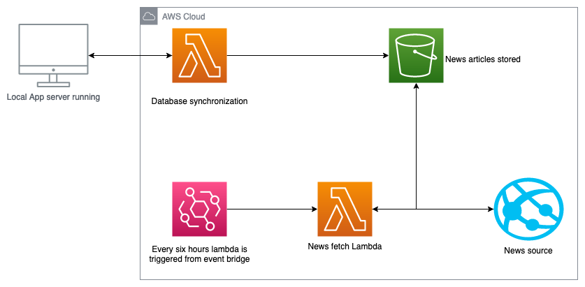

# Lucid - A news summary generator
Full write up in file marked "project_write_up.pdf"
Note the tests have been removed from the learn version of this site due to size limitations.

## Overview of the program
The program uses the following library's
### Python
- Django (used to create front end)
- OpenAI (used for GPT-3 interaction)
- boto3(used for AWS interaction)
- Beautiful Soup (used for web scraping)
- Huggingface(sentence-transformers) used for pretrained models
- Rouge-score used for running rouge score
### Server infrastructure 

### Javascript
- Vue.js (handing front end events)
- Vue-router (url routing on the front end)
- Axios (sending API calls)
- Bootstrap (for making professional UI elements)

## How to run program with conda (https://docs.conda.io/projects/conda/en/latest/user-guide/install/index.html)
1. Download the repo via Github
2. Create an environment `conda create -n myenv python=3.6`
3. Then run `conda env update -f env.yaml` this should install all the dependencies required for the project. If this command does not work try this `conda env update -f env.yaml --prune`
4. Then activate the environment by running `source activate myenv`
5. Start the program using `python manage.py runserver` this can take a while since initially the models will need to be downloaded.
6. Go to [localhost:8000](https://localhost:8000 "localhost:8000")
7. Enter an item into the search box the search term "War in ukraine" yields the best results

## Important features
### Creating summary of news articles
Functions are inside the `ingestion.py`
### Searching transformer based seen in file
Functions are inside the `search.py`
### Fetching data from the internet
This handled inside the functions file `s3_fetch.py` fetched data from the s3.environment
`fetch_news.py`
### Front end parts
Javascript inside `static/Search_results.js`
HTML stored `templates/`
